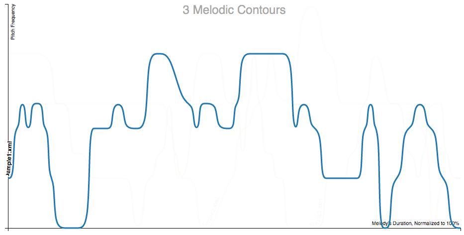
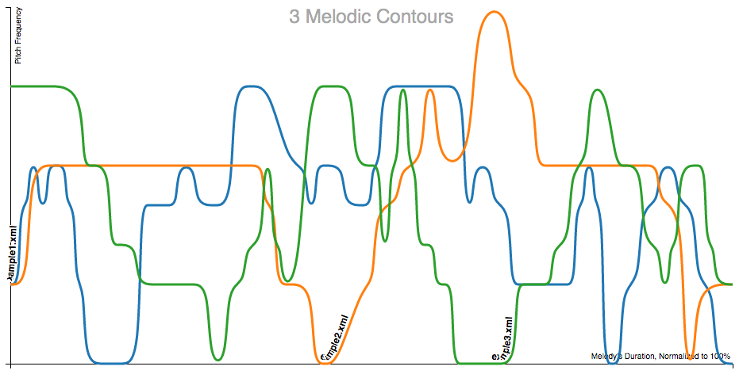

ContourViz
--------

This package uses music21 to process musical notation and creates a web-based visual
representation of the melodic contour within the browser. It creates a stand-alone
website within the current working directory called 'results'. It then serves this
folder locally within the web browser, offering contour maps of either a single melody
or all of the notation files within the passed folder path.

To install:

    >>> pip install contourviz

To use on the command line:

    >>> # Navigate to an empty directory (or at least one without a folder called 'results')
    >>> # Create a chart of multiple melodic contours
    >>> chart-contours '/path/to/directory/full/of/xml/or/mxl/files'
    >>>
    >>> # Create a chart of a single melodic contour
    >>> chart-single-contour '/path/to/file.xml'

For use within the Python interpreter:

    >>> # Navigate to an empty directory (or at least one without a folder called 'results')
    >>> testFile = '/path/to/file.xml'
    >>> testPath = '/path/to/directory/full/of/xml/or/mxl/files'
    >>>
    >>> # Create a single contour line from a given file
    >>> createDataFromFile(testFile)
    >>>
    >>> # Create a set of contour lines from all files in a given directory
    >>> createDataFromDirectory(testPath)

In progress updates and known issues include the following:

* It currently only works with single line (monophonic) melodies.
* The frequency labels draw from a logarithmic reading of each note's frequency, not note names.
* When using the interpreter: after serving the file, the Python script does not return to the correct working directory. This may require exiting and reentering the interpreter or navigating the command line to repeat the process.
